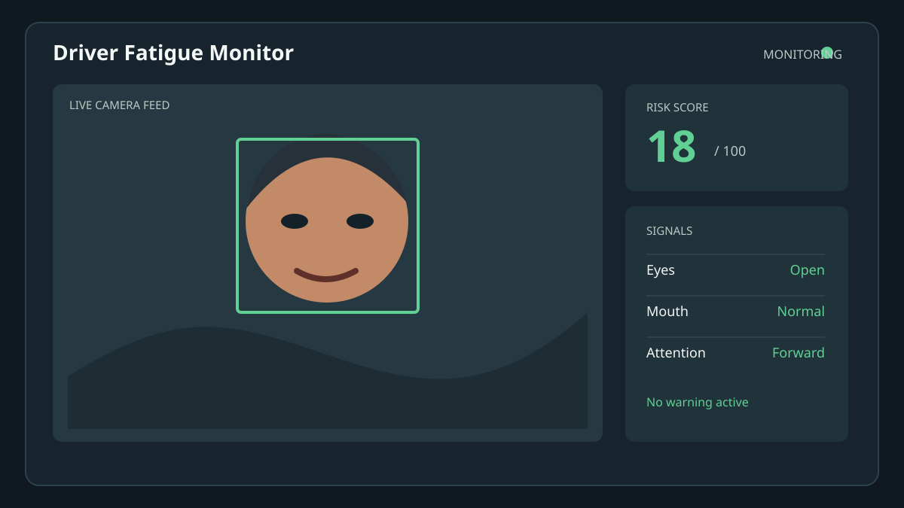
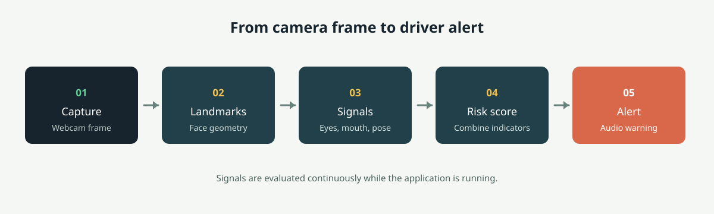

# Driver Fatigue & Distraction Monitor

A local computer-vision prototype that uses a webcam to watch for visual signs of driver fatigue and distraction. It displays the camera feed, face landmarks, detection state, and risk score in real time, then plays an audio warning when configured thresholds are reached.



> This project is for education and experimentation. It is not a certified automotive safety system and must not be used as the sole safety mechanism in a vehicle.

## What It Detects

- Face presence and facial landmarks
- Prolonged eye closure and drowsiness
- Yawning
- Basic face direction and distraction signals
- A combined risk score
- Audio warnings through `assets/alarm.wav`



## Requirements

- Python 3.9 or newer
- A working webcam
- A desktop environment with an available audio output
- MediaPipe's face landmarker model at `assets/face_landmarker.task`

The application currently targets desktop Python environments. Camera and audio permissions may need to be granted by the operating system.

## Installation

### Linux and macOS

```bash
python3 -m venv venv
source venv/bin/activate
pip install -r requirements.txt
```

### Windows

```powershell
python -m venv venv
venv\Scripts\activate
pip install -r requirements.txt
```

The included setup script can be used on Linux or macOS:

```bash
chmod +x setup.sh
./setup.sh
```

## Run locally

Activate the virtual environment and start the monitor:

```bash
streamlit run app.py
```

Open the local URL shown by Streamlit, allow camera access, and press **START** in the video panel.

## Deploy

This is a Streamlit web app, not a desktop OpenCV window. For Render or another process-based host, use:

- **Build command:** `pip install -r requirements.txt`
- **Start command:** `streamlit run app.py --server.address=0.0.0.0 --server.port=$PORT`
- **Python:** 3.11.9 (recorded in `runtime.txt` and `.python-version`)

The included `Procfile` contains the same start command. The deployed URL must use HTTPS because browser camera access and WebRTC are blocked on insecure public URLs. After opening the URL, allow camera permissions and press **START**.

Streamlit Community Cloud can deploy `app.py` directly from this repository. In the app's **Manage app** settings, select Python 3.11 if it does not read the runtime files automatically, then use **Reboot app** to rebuild the environment.

### Render

The repository includes `render.yaml` for a one-click Render deployment. In
Render, choose **New +** -> **Blueprint**, connect this repository, and apply
the detected service. It installs dependencies with Python 3.11 and starts
Streamlit on Render's assigned port. Open the resulting HTTPS URL and allow
camera access in the browser.

### Vercel

Vercel cannot run the Streamlit/WebRTC server, so the repository also includes a
static browser implementation. It runs face landmark detection locally with
MediaPipe Tasks and does not upload camera frames to a server.

1. Import this GitHub repository into Vercel.
2. Leave the framework preset as **Other** and leave the build command empty.
3. Deploy from the repository root.
4. Open the deployment URL over HTTPS, allow camera access, and press **Start camera**.

The Vercel entry point is `index.html`; `app.py` remains the Streamlit entry
point for Render and Streamlit Community Cloud.

## Project Layout

```text
driver-fatigue-monitor/
├── app.py                         # Streamlit application and dashboard
├── requirements.txt               # Python dependencies
├── setup.sh                       # Environment setup helper
├── assets/
│   ├── alarm.wav                  # Warning sound
│   ├── detection-flow.svg         # README workflow illustration
│   ├── face_landmarker.task       # MediaPipe model
│   └── monitor-dashboard.svg      # README dashboard illustration
├── detector/
│   ├── distraction_detector.py    # Face direction checks
│   ├── face_detector.py           # Face landmark extraction
│   └── fatigue_detector.py        # Eye and mouth signal checks
├── tests/
│   └── test_warning_system.py     # Warning behavior tests
└── utils/
    ├── alert.py                   # Audio alert handling
    └── constants.py               # Shared thresholds and settings
```

## How It Works

1. OpenCV reads frames from the default webcam.
2. MediaPipe extracts face landmarks using the bundled task model.
3. Detector modules measure eye closure, mouth opening, and face direction.
4. The application combines those signals into a risk score.
5. The alert utility plays the warning sound when the risk state requires it.

The thresholds are centralized in `utils/constants.py`, so experiments can be made without changing the main application loop. Lighting, camera position, glasses, facial pose, and camera quality can affect results.

## Tests

Install the dependencies, then run:

```bash
python -m pytest
```

The tests cover the warning-system behavior. Hardware-dependent camera and audio behavior should also be checked on the target machine.

## Troubleshooting

**The camera does not open**

- Confirm that no other application is using the webcam.
- Check operating-system camera permissions.
- Try a different camera index in `app.py` if the default device is not index `0`.

**The model cannot be loaded**

- Confirm that `assets/face_landmarker.task` exists and is readable.
- Run the command from the project root so relative asset paths resolve correctly.

**No warning sound is heard**

- Check the system volume and selected audio output.
- Confirm that `assets/alarm.wav` exists.
- Verify that the desktop audio backend required by the installed Pygame version is available.

## License and Safety

No production safety, medical, legal, or fitness-for-purpose claims are made by this prototype. Do not drive while testing or adjusting the application. Add an appropriate license before redistributing the project.